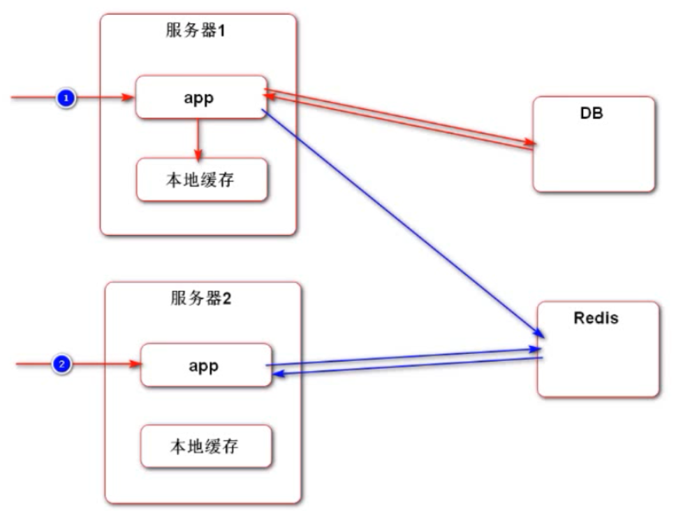
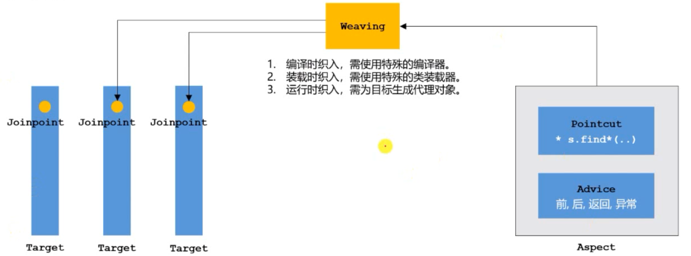

## 项目复盘

----

目录

[TOC]

开发的是牛客社区，牛客讨论区页面。类似于微博，豆瓣等页面。

整个项目可以实现的功能：用户的登录，敏感词过滤，发帖，记住用户的登录状态，关注和粉丝（高频操作，需要缓存），曾经的回复还有发表的帖子，私信操作，系统消息（使用专门的消息队列），全栈搜索，统计UV和DAO。


整个项目使用的技术架构

* spring boot
* spring 、spring MVC 、mybatis
* Redis、kafka、elasticsearch
* spring security、spring actuator


### chapter1：

#### 1.1 spring boot核心作用：

-起步依赖、自动配置、端点监控

#### 1.2 spring入门

（1）spring framework

* spring core：ioc、aop
* spring data access（访问数据库）：transactions、spring mybatis
* web servlet（开发网站）：spring MVC
* integration（整合）：email、scheduling（定时任务）、amqp（消息队列）、security

（2）spring ioc

* Inversion of Control：控制反转，是一种面向对象编程的设计思想，降低耦合
* Dependency Injection：依赖注入，是IoC思想的实现方式
* Ioc Container：IoC容器，是实现依赖注入的关键，本质上是一个工厂

#### 1.3 spring MVC

（1）三层架构

表现层、业务层、数据访问层

（2）MVC三层架构，主要是解决表现层的逻辑

* Model：模型层，主要负责处理请求
* View：视图层，主要负责返回给客户端页面的渲染
* Controller：控制层，主要是作为Model和View的中间传输纽带

（3）核心组件

前端控制器：DispatcherServlet

（4）Thymeleaf

* 模板引擎：生成动态的HTML
* Thymeleaf：倡导自然模板，即以HTML文件为模板
* 常用语法：标准表达式、判断与循环、模板的布局

#### 1.4 mybatis入门

（1）核心组件

* SqlSessionFactory：用于创建SqlSession的工厂类
* SqlSession：MyBatis的核心组件，用于向数据库执行SQL
* 主配置文件：XML配置文件，可以对MyBatis的底层行为作出详细的配置
* Mapper接口：就是DAO接口，在MyBatis中习惯性的称之为Mapper
* Mapper映射器：用于编写SQL，并将SQL和实体类映射的组件，采用XML、注解均可实现

#### 1.5 开发社区首页

（1）开发流程

1次请求的执行过程

（2）分步实现

* 开发社区首页，显示前10个帖子
* 开发分页组件，分页显示所有的帖子

### chapter2：开发社区登录模块

#### 2.1 发送邮件

* 邮箱设置：启用客户端SMTP服务
* Spring Email：导入jar包，邮箱参数配置，使用JavaMailSender发送邮件
* 模板引擎：使用Thymeleaf发送HTML邮件

#### 2.2 开发注册功能

整个功能较为复杂，我们按照将功能拆分为若干次请求，然后我们分请求来逐步开发。

（1）访问注册页面

点击顶部区域内的链接，打开注册页面。

（2）提交注册数据

* 通过表单提交数据
* 服务端验证账号是否已经存在，邮箱是否已经注册。
* 服务端发送激活邮件

（3）激活注册账号

点击邮件中的链接，访问服务端的激活服务。

#### 2.3 会话管理

（1）http的基本性质

* HTTP是简单的
* HTTP是可扩展的
* HTTP是无状态的，有会话的

（2）Cookie

* 是服务器发送到浏览器，并保存在浏览器端的一小块数据
* 浏览器下次访问该服务器时，会自动携带这块数据，将其发送给服务器

（3）Session

* 是JavaEE的标准，用于在服务端记录客户端信息。
* 数据存放在服务端更加安全，但是也会增加服务端的内存压力。

（4）使用cookie和session的时候遇到的问题

在分布式部署的时候，由于有多个服务器，并且会进行负载均衡，所以此时会导致，每一次请求都不一定被分配到同一台服务器，这样就很难找到每个cookie对应的session了。解决方案有三种

* 粘性请求：将同一地址的请求固定的分配到同一个session中。**缺点**：这样难以保证负载均衡，不完美
* 同步session：将每一个session在每一个服务器上同步一份。**缺点**：这样会增加服务器的压力，并且服务器之间会增加耦合性。
* 专门使用一个服务器来存放session：将所有服务器产生的session都存放在一台专门的服务器上，每一台服务器在需要使用session的时候，都到这个专门的session服务器上去请求获得session数据。**缺点**：会有隐患，如果这个存放session的服务器出问题了，那么所有的服务器都会受到影响。

主流的解决方案是：不使用session，将所有需要进行会话的数据都存放在数据库中，每一次需要会话的时候，都从数据库中取出。目前的服务器集群和数据获取都是很成熟稳定的。**缺点**：使用关系型数据库的话，数据一般存放在硬盘上，存取的速度较慢，影响整体的性能。

最后的解决方案是：使用非关系型数据库，比如Redis，用来存放客户端与服务端的数据会话问题。


#### 2.4 生成验证码

使用kaptcha工具来生成验证码：

* 导入jar包
* 编写kaptcha配置类
* 生成随机字符、生成图片

**登录的时候，将生成的验证码存放在服务器端，使用session来存放。**

#### 2.5 开发登录、退出功能

（1）访问登录页面

点击顶部区域内的链接，打开登录页面内

（2）登录

* 验证账号、密码、验证码
* 成功时，生成登录凭证（**存放在数据库**），发放给客户端（**使用cookie进行实现**）
* 失败时，跳转回登录页

（3）退出

* 将登录凭证修改为失效状态
* 跳转至网站首页

#### 2.6 显示登录信息

（1）拦截器实例

* 定义拦截器，实现HandlerIntercepter
* 配置拦截器，为它指定拦截、排除的路径

（2）拦截器应用

* 在请求开始时查询登录用户：使用拦截器，拦截登录请求，并且从请求中获取名为“ticket”的cookie值，该cookie值就是存放在login_ticket表中的ticket。然后通过这个ticker来查询用户的id，进而查询到登录的用户信息。
* 在本次请求中持有用户数据：一个用户和服务器是多对一的关系，对服务器而言，每一次的请求都是一个线程，每一个线程都应该拥有当前用户的全部信息，并且线程之间需要实现线程隔离，各自将用户信息存储到自己的工作缓存空间中。所以我们使用多线程环境ThreadLoccal数组，将每一次请求的线程作为key，将当前线程内的用户user作为值进行存储，最后在请求返回给模板引擎之前，需要将user存放到modelandview中，以供后面的模板视图使用，展示用户信息。
* 在模板视图上显示用户数据：从modelandview中获取到当前请求的用户信息，将相关的用户信息展示在页面的头部。
* 在请求结束时清理用户数据：在请求结束的时候，我们需要将这个线程中存放的用户数据也清除掉，避免用户信息越来越多，影响最后的服务器性能。

#### 2.7 账号设置

（1）上传文件

* 请求：必须是post请求
* 表单：enctype = "multipart/form-data"
* Spring MVC ：通过MultipartFile处理上传文件

（2）开发步骤

* 访问账号设置页面
* 上传头像：通过post请求，将图像传给MultipartFile对象，然后此对象将图片存储到指定的目标文件夹。
* 获取头像：使用输入输出流来获取存储在服务器上图像文件

#### 2.8 检查登录状态

（1）使用拦截器

* 在方法前标注自定义注解：使用自定的@LoginRequired注解完成检验，如果带有此注解，则在检查当前请求内的HostHolder对象是否为空，如果为空，则代表当前没有登录用户，将整个页面返回到登录页面。
* 拦截所有的请求，只处理带有该注解的方法：在注册拦截器的时候，我们排除静态资源，以提高效率。

（2）自定义注解

* 常用的元注解：@Target、@Retention、@Document、@Inherited
* 如何读取注解：使用反射完成
  * Method.getDeclaredAnnotations()
  * Method.getAnnotation(Class<T> annotationClass)


### chapter3：开发社区核心功能

#### 3.1 过滤敏感词

（1）前缀树

* 名称：Trie、字典树、查找树
* 特点：查找效率高、消耗内存大
* 应用：字符串检索、词频统计，字符串排序等

（2）敏感词过滤器

* 定义前缀树

  ```java
      /**
       * 前缀树的节点结构
       */
      private class TrieNode{
  
          //关键词结束标识
          private boolean isKeyWordEnd = false;
  
          /**
           * 子节点
           * key为子节点的字符
           * value为子节点
           */
          Map<Character,TrieNode> subNode = new HashMap<>();
  
          public boolean isKeyWordEnd() {
              return isKeyWordEnd;
          }
  
          public void setKeyWordEnd(boolean keyWordEnd) {
              isKeyWordEnd = keyWordEnd;
          }
  
          /**
           * 添加子节点
           * @param key
           * @param value
           */
          public void addSubNode(Character key,TrieNode value){
              subNode.put(key,value);
          }
  
          /**
           * 获取子节点
           * @param key
           * @return
           */
          public TrieNode getSubNode(Character key){
              return subNode.get(key);
          }
      }
  ```

  

* 根据敏感词，初始化前缀树

  ```java
     public void init(){
          try (
                  InputStream is = this.getClass().getClassLoader().getResourceAsStream("sensitive-words.txt");//读取敏感字符文件的字节流
                  BufferedReader reader =new BufferedReader(new InputStreamReader(is));//使用缓冲流来处理
          ){
              String keyWord;
              while ((keyWord = reader.readLine()) != null){
                  //添加到前缀树中
                  this.addKeyWord(keyWord);
              }
          } catch (Exception e) {
              e.printStackTrace();
          }
  
      }
  
      //将一个敏感词添加到前缀数中
      private void addKeyWord(String keyWord) {
          TrieNode temp = rootNode;
          for (int i = 0 ; i < keyWord.length() ; i++){
              char key = keyWord.charAt(i);
              TrieNode subNode = temp.getSubNode(key);
              if (subNode == null){
                  subNode = new TrieNode();
                  temp.addSubNode(key,subNode);
              }
              //指向下一个子节点
              temp = subNode;
              //作为结束标识符
              if (i == keyWord.length()-1){
                  temp.setKeyWordEnd(true);
              }
          }
      }
  ```

  

* 编写过滤敏感词的方法

  ```java
  	public String filter (String text){
          if (StringUtils.isBlank(text)){
              return null;
          }
          //指针1
          TrieNode tempNode = rootNode;
          //指针2
          int begin = 0;
          //指针3
          int position = 0;
          //结果
          StringBuilder sb = new StringBuilder();
  
          for (int i = 0 ; i < text.length() ; i++){
              char c = text.charAt(position);
              //当前字符是特殊符号
              if (isSymbol(c)){
                  if (tempNode == rootNode){//指针1为头结点
                      sb.append(c);
                      //将指针2向后移1位
                      begin++;
                  }
                  //将指针3向后移1位
                  position++;
                  continue;
              }
              tempNode = tempNode.getSubNode(c);
  
              if (tempNode == null){
                  //表示当前begin到position之间的字符串不是敏感词
                  sb.append(text.charAt(begin));
                  //将begin和position进行归位
                  position = ++begin;
                  //将指针1也归位
                  tempNode = rootNode;
              }else if (tempNode.isKeyWordEnd()){
                  //表示当前begin到position为敏感词汇，则进行和谐处理
                  sb.append(REPLACEMENT);
                  //对begin和position进行重新归位
                  begin = ++position;
                  tempNode = rootNode;
              }else {
                  //当前并不是敏感词，并且还没有到前缀树的末端，检查下一个字符
                  position++;
              }
          }
          //处理最后端还没有处理字符串
          sb.append(text.substring(begin));
          return sb.toString();
      }
  
      /**
       * 判断是否为特殊符号
       * 如果是特殊符号，则返回true
       * 如果不是，则返回false
       * @param c
       * @return
       */
      private boolean isSymbol(Character c){
          /*
          isAsciiAlphanumeric表示当前字符是否是合法字符，如果合法，则为true
          0x2E80~0x9FFF是东亚字符
           */
          return !CharUtils.isAsciiAlphanumeric(c) && (c < 0x2E80 || c > 0x9FFF);
      }
  
  ```
#### 3.2 发布帖子

（1）AJAX

* Asynchronous JavaScript and XML
* 异步的JavaScript与XML，不是一门新技术，只是一个新的属于
* 使用AJAX，网页能够将增量更新呈现在页面上，而不需要刷新整个页面
* 虽然X代表XML，但是目前JSON的使用比XML更加普遍

（2）示例

* 使用jQuery发送AJAX请求

  使用AJAX技术是一个固定的模板，主要有下面三个步骤：

```html
  <!DOCTYPE html>
  <html lang="en">
  <head>
      <meta charset="UTF-8">
      <title>AJAX</title>
  </head>
  <body>
      <p>
          <input type="button" value="发送" onclick="send();">
      </p>
  
      <script src="https://code.jquery.com/jquery-3.3.1.min.js" crossorigin="anonymous"></script>
      <script>
          function send() {
              $.post(
                  "/community/alpha/ajax",
                  {"name":"zhangsan","age":23},
                  function (data) {
                      console.log(typeof (data));/*直接获取到的data数据类型为String*/
                      console.log(data);
  
                      data = $.parseJSON(data);/*将data的数据类型从String转化为json数据类型*/
                      console.log(typeof (data));
                      console.log(data.code);
                      console.log(data.msg);
                  }
              );
          }
      </script>
  </body>
  </html>
```


使用```$.post()```或者```$.get()```方法，里面主要需要写三个内容，第一个是异步请求时需要访问的路径，第二个是需要传递的数据，第三个是一个匿名的回调函数，回调函数中的```data```就是从服务器传回给客户端的String类型数据。


（3）实践

* 采用AJAX请求，实现发布帖子的功能

  ```javascript
  //获取标题和内容
  	var title = $("#recipient-name").val();
  	var content = $("#message-text").val();
  	//发送异步请求(POST)
  	$.post(
  		CONTEXT_PATH + "/discuss/add",
  		{"title":title,"content":content},
  		function (data) {
  			//将data数据转换为json格式
  			data = $.parseJSON(data);
  			//在提示框中显示返回消息
  			$("#hintBody").text(data.msg);
  			//显示提示框
  			$("#hintModal").modal("show");
  			//2秒后，自带隐藏提示框
  			setTimeout(function(){
  				$("#hintModal").modal("hide");
  				//刷新页面
  				if (data.code == 0){
  					window.location.reload();
  				}
  			}, 2000);
  		}
  	);
  ```

#### 3.3 帖子详情

（1）DiscussPostMapper

（2）DiscussPostService

（2）DiscussPostController

（4）index.html

* 在帖子标题上增加访问详情页面的链接

（5）discuss-detail.html

* 处理静态资源的访问路径
* 复用index.html的header区域
* 显示标题、作者、发布时间、帖子正文等内容

#### 3.4 事务管理

（1）什么是事务

事务是由N步数据库操作序列组成的逻辑执行单元，这系列操作要么全执行，要么全放弃执行

（2）事务的特性（ACID） 

* 原子性（Atomicity）：事务的是应用中不可再分的最小执行体
* 一致性：事务执行的结果，必须使数据从一个一致性状态，变为另一个一致性状态
* 隔离性：各个事务的执行互不干扰，任何事务的内部操作对其他的事务都是隔离的
* 持久性：事务一旦提交，对数据所做的任何改变都要记录到永久存储器中。

（3）事务的隔离性

* 常见的并发异常
  * 更新：
    * 第一类丢失更新：由于某个事务的**回滚**，导致另一个事务已更新的数据丢失
    * 第二类丢失更新：由于某个事务的**提交**，导致另一个事务已更新的数据丢失
  * 读异常：
    * 脏读：某个事务读取到了另一个事务还没有提交的数据
    * 不可重复读：某个事务对同一个数据**前后（非常短的时间内）**读取的结果不一致。
    * 幻读：某一个事务对同一个表**前后（非常短的时间内）**查询到的行数不一致。主要是指查询的行数
* 常见的隔离级别
  * read uncommitted：读取未提交的数据
  * read committed：读取已提交的数据
  * repeatable read：可重复读
  * serializable：串行化


（4）实现机制

* 悲观锁（数据库）
  * 共享锁（S锁）：事务A对某数据加了共享锁之后，其他事务只能对该数据加共享锁，但不能加排它锁。
  * 排它锁（X锁）：事务A对某数据加了排它锁之后，其他事务对此数据什么锁都不能加
* 乐观锁（自定义）
  * 主要版本号、时间戳等方式：在更新数据前，检查版本号（或者时间戳）是否发生变化，若变化则取消本次更新，否则就更新数据（版本号+1或者更新时间戳为当前时间）

（5）spring事务管理

* 声明式事务

  * 通过XML配置，声明某方法的事物特征

  * 通过注解，声明某方法的事务特征：直接方法上面使用此注解即可

    ```java
    /**
         * 对于propagation（传播机制）几种参数的解释
         * REQUIRED:支持当前事务，如果不存在其他事务，则创建一个新事务
         * REQUIRES_NEW：创建一个新事务，并且暂停当前事务
         * NESTED：如果当前存在事务，则嵌套在该事务中执行（独立的提交和回滚），否则就和REQUIRED一样。
         * @return
         */
    @Transactional(isolation = Isolation.READ_COMMITTED, propagation = Propagation.REQUIRED)
    public Object save1(){
            //新增用户
            User user = new User();
            user.setUsername("alpha");
            user.setSalt(CommunityUtil.generateUUID().substring(0,5));
            user.setPassword(CommunityUtil.md5("123"+user.getSalt()));
            user.setEmail("alpha@qq.com");
            user.setHeaderUrl("http://image.nowcoder.com/head/99t.png");
            user.setCreateTime(new Date());
            userMapper.insertUser(user);
    
            //新增帖子
            DiscussPost post = new DiscussPost();
            post.setUserId(user.getId());
            post.setTitle("HELLO");
            post.setContent("新人报道");
            post.setCreateTime(new Date());
            discussPostMapper.insertDiscussPost(post);
    
            Integer.valueOf("abc");
    
            return "ok";
        }
    ```

* 编程式事务：

  * 通过TransactionTemplate管理事务（这个对象是spring自动管理的bean，可以直接注入使用，不需要我们自己来创建），并通过它执行数据库的操作。

    ```java
    public Object save2(){
            transactionTemplate.setIsolationLevel(TransactionDefinition.ISOLATION_READ_COMMITTED);
            transactionTemplate.setPropagationBehavior(TransactionDefinition.PROPAGATION_REQUIRED);
    
            return transactionTemplate.execute(new TransactionCallback<Object>() {
                @Override
            public Object doInTransaction(TransactionStatus status) {
                    业务逻辑;
                return "ok";
            }
                  
    ```
    

#### 3.5 显示评论

（1）数据层

* 根虎实体查询一页评论数据
* 根据实体查询评论的数量

（2）业务层

* 处理查询评论和评论数量的业务

（3）表现层

* 显示帖子详情数据时，同时显示该帖子所有的评论数据。

#### 3.6 添加评论

（1）数据层

* 增加评论数据
* 修改帖子的评论数量

（2）业务层

* 处理添加评论的业务（需要做事务管理）：先增加评论、再更新帖子的评论数量

（3）表现层

* 处理添加评论数据的请求
* 设置添加评论的表单。

#### 3.7 私信列表

（1）私信列表

* 查询当前用户的会话列表，每个会话只显示一条最新的私信
* 支持分页

（2）私信详情

* 查询某个会话所包含的私信
* 支持分页显示。

#### 3.8 发送私信

（1）发送私信

* 采用异步的方式发送私信
* 发送成功后刷新私信列表

（2）设置已读

* 访问私信详情时，将显示的私信设置为已读状态

#### 3.9 统一处理异常

在MVC三层架构里面，顺序依次是：表现层-->业务层-->数据层，当整个程序遇到异常的时候，每一层的异常都会依次向上抛出，最后到达表现层。所以，表现层属于最顶层，我们在处理项目中的异常的时候，只需要抓住变现层就好。所有的异常统一在表现层进行处理，就没必要在各个层单独处理了！

（1）@ControllerAdvice（控制器通知）

* 用于修饰类，表示该类是Controller的全局配置类

* 在此类中，可以对Controller进行如下三种全局配置：

  异常处理方案，绑定数据方案、绑定参数方案

（2）@ExceptionHandler

* 用于修饰方法，该方法会在Controller出现异常后被调用，用于处理捕获到的异常

* **应用场景：**我们使用@ControllerAdvice对所有的Controller进行统一的处理，然后使用@ExceptionHandler注解表明我们仅仅是处理Exception.class类型的异常。

  ```java
  @ControllerAdvice(annotations = Controller.class)
  public class ExceptionAdvice {
  
      private static final Logger logger = LoggerFactory.getLogger(ExceptionAdvice.class);
  
      @ExceptionHandler({Exception.class})
      public void handleException(Exception e, HttpServletRequest request, HttpServletResponse response) throws IOException {
  
          logger.error("服务器发生异常"+e.getMessage());
          for (StackTraceElement element : e.getStackTrace()) {
              logger.error(element.toString());
          }
  
          String xRequestedWith = request.getHeader("x-requested-with");
          if ("XMLHttpRequest".equals(xRequestedWith)){//代表是异步请求，希望我们返回一个字符串
              response.setContentType("application/plain;charset=utf-8");
              PrintWriter writer = response.getWriter();
              writer.write(CommunityUtil.getJSONString(1,"服务器异常"));
          }else {
              response.sendRedirect(request.getContextPath() + "/error");
          }
      }
  }
  ```

（3）@ModelAttribute

* 用于修饰方法，该方法会在Controller方法执行前被调用，用于为Model对象绑定参数。
* **应用场景：**一个参数可能会传递给多个thymeleaf模板进行调用，我们使用此注解，将此公共的参数绑定到model里面。

（4）@DataBinder

* 用于修饰方法，该方法会在Controller方法执行前被调用，用于绑定参数的转换器。

* **应用场景：**在我们正常的使用过程中，从服务器端传递过来的参数可以根据controller方法中我们给定的实体类，将其转化。例如我们在编写下面的代码时：

  ```java
      @RequestMapping(path = "/add/{discussPostId}",method = RequestMethod.POST)
      public String addComment(@PathVariable("discussPostId") int discussPostId, Comment comment)
  ```

  我们从客户端传递给服务器端的参数是这样的：

  ```html
  <div>
      <input type="text" class="input-size" name="content" placeholder="请输入你的观点"/>
      <input type="hidden" name="entityType" value="2">
      <input type="hidden" name="entityId" th:value="${cvo.comment.id}">
  </div>
  ```

  但是springBoot却直接将传递的数据封装到了Comment类中，能做到这一点的原因就是，spring在底层做了大量的参数转换器。如果spring提供的参数转换器不够了，我们就可以自定义参数转换器。

#### 3.10 统一记录日志

在我们前面使用到的拦截器主要是从表现层开始拦截，而控制器通知也是在表现层进行拦截，并且只能在有异常的时候才能够起作用。

但是在我们的项目中，已经开发出了很多个模块，我们可能会在没有发生异常的时候也需要进行记录日志，或者在业务层和数据层进行记录。

与此同时，我们记录日志属于系统需求，而业务组件之类的属于业务需求，我们需要将两者进行分离，降低耦合性。所以我们使用aop的方式来完成这个功能。


（1）AOP概念

* aspect oriented programing，面向切面编程。
* aop是一种编程思想，是对oop的补充，可以进一步提高程序的效率。


* aspect：aop编程过程中，我们主要是对aspect进行编程
* joinpoint：是我们可以织入代码的位置，比如属性，方法，构造器等等

* pointcut：里面存放我们选择需要织入代码的位置，

* advice：编写我们织入代码的具体逻辑，以及织入代码的具体位置。

（2）aop的实现

* aspectJ
  * aspectJ是语言级的实现，它扩展了java语言，定义了aop语法
  * aspectJ在编译期织入代码，它有一个专门的编译器，用来遵守java字节码规范的class文件。
* spring AOP
  * spring aop使用纯java实现，它不需要专门的编程过程，也不需要特殊的类装载器
  * spring aop在**运行时通过代理的方式织入代码**，只支持方法类型的连接点（只能在对象bean的方法中进行织入操作，在实际使用过程中，基本上都是对bean的方法进行织入代码）
  * spring支持对aspectJ的继承

 （3）spring aop

* jdk动态代理
  * java提供的动态代理技术，可以在**运行时创建接口的代理实例**
  * spring aop默认采用此种方式，在接口的代理实例中织入代码
* CGLib动态代理
  * 采用底层的字节码技术，**在运行时创建子类代理实例**。
  * **当目标对象不存在接口时**，spring aop会采用此种方式，在子类实例中织入代码。

项目中使用aop的地方：

```java
/**
 * 利用切面编程，
 * 对所有的service在运行前进行记录业务日志
 */
//@Component
//@Aspect
public class ServiceLogAspect {

    private static final Logger logger = LoggerFactory.getLogger(ServiceLogAspect.class);

    /**
     * 表示在所有的业务组件都来做这件事
     */
    @Pointcut("execution(* com.nowcoder.community.service.*.*(..))")
    public void pointcut(){

    }

    /**
     * 用户[ip],在某时间[xxx]，访问了某某方法[com.nowcoder.community.service.xxx()]
     * @param joinPoint 连接点
     */
    @Before("pointcut()")
    public void before(JoinPoint joinPoint){
        ServletRequestAttributes attributes = (ServletRequestAttributes) RequestContextHolder.getRequestAttributes();
        if (attributes == null){
            return;
        }
        HttpServletRequest request = attributes.getRequest();
        String ip = request.getRemoteHost();
        String now = new SimpleDateFormat("yyyy-MM-dd HH:mm:ss").format(new Date());
        //前半部分为类名，后半部分为方法名
        String target = joinPoint.getSignature().getDeclaringTypeName() + "." + joinPoint.getSignature().getName();
        logger.info(String.format("用户[%s],在[%s],访问了[%s]",ip,now,target));
    }
}
```

通过使用@Before , @Around , @After , @AfterReturning , @AfterThrowing 来控制织入的时机。


### chapter4：Redis

#### 4.1 Redis入门

* Redis是一款基于基于键值对的NoSQL数据库，它的值支持多种数据结构：字符串（Strings），哈希（hashes）、列表（lists）、集合（sets）、有序集合（sorted sets）等。
* Redis将所有的数据都存放在内存中，所以它的读写性能十分惊人。同时Redis还可以将内存中的数据以快照（RDB）或日志（AOF）的形式保存在硬盘上，以保证数据的安全性。
  * RDB：将数据备份在硬盘里面，恢复起来快。但是备份效率低
  * AOF：将命令以追加的方式进行写入文件中，恢复的时候直接运行命令即可。恢复起来慢
* Redis典型的应用场景包括：缓存、排行榜、计数器、社交网络、消息队列。

#### 4.2 spring依赖整合Redis

（1）引入依赖

* spring-boot-starter-data-redis

（2）配置Redis

* 配置数据库参数

* 编写配置类，构造RedisTemplate

  ```java
  /**
   * redis 的配置类
   */
  @Configuration
  public class RedisConfig {
      @Bean
      public RedisTemplate<String, Object> redisTemplate(RedisConnectionFactory factory) throws UnknownHostException {
          RedisTemplate<String,Object> template = new RedisTemplate<>();
          //将连接工厂传入到template中，作为后面的连接方式
          template.setConnectionFactory(factory);
  
          //设置redis的key参数序列化方式
          template.setKeySerializer(RedisSerializer.string());
          //设置redis的value参数序列化方式，以json数据格式进行转化，因为json的数据格式具有结构性
          template.setValueSerializer(RedisSerializer.json());
          //设置hash的key的序列化方式
          template.setHashKeySerializer(RedisSerializer.string());
          //设置hash的value的序列化方式
          template.setHashValueSerializer(RedisSerializer.json());
  
          //触发配置文件
          template.afterPropertiesSet();
          return template;
      }
  }
  ```

  

（3）访问Redis

* redisTemplate.opsForValue()
* redisTemplate.opsForHash()
* redisTemplate.opsForList()
* redisTemplate.opsForSet()
* redisTemplate.opsForZSet()

（4）编程式事务

在Redis数据库中，也存在事务，也有声明式事务和编程式事务。同样的，声明式事务管理的范围更加宽泛，不利于查询，在实际开发中，一般使用编程式事务。

**在开启事务和提交事务之间**，所有命令都是存放在队列里，并不会立即生效，所以在提交事务之前做查询是没有效果的。

```java
    /**
     * 编程式事务
     * 在redis的事务中，所有的操作都是redis先存放在队列中，并不会立即执行，
     * 当事务提交的时候，所有的命令一起执行操作，
     * 所以在redis的事务中，查询操作一般不会放在事务中。
     */
    @Test
    public void testTx (){
        Object obj = redisTemplate.execute(new SessionCallback() {
            @Override
            public Object execute(RedisOperations operations) throws DataAccessException {
                String redisKey = "test:tx";

                operations.multi();//开启事务
                BoundListOperations boundListOperations = operations.boundListOps(redisKey);
                boundListOperations.leftPush("zhangsan");
                boundListOperations.leftPush("lisi");
                boundListOperations.leftPush("wangwu");
                System.out.println(boundListOperations.range(0,2));
                return operations.exec();//提交事务
            }
        });
        System.out.println(obj);
    }
```

#### 4.3 点赞

点赞属于一个高频的动作行为，对于一个大V而言，一篇文章的点赞功能可能会在短时间内进行多次操作。此时我们就需要考虑性能优化问题，所以我们选择在Redis中来进行部署，提升性能。

（1）点赞

* 支持对帖子、评论点赞
* 第1次点赞，第2次点赞

（2）首页点赞数量

* 统计帖子的点赞数量

（3）详情页面点赞数量

* 统计点赞数量
* 显示点赞的状态

在Redis中使用set数据结构，存储每个点赞的用户的id，便于以后业务的其他修改，可以得到更加详细的信息。

#### 4.4 我收到的赞

由于我们需要在个人主页上，显示用户所有获得的赞的数量。我们可以根据上一节的内容，将所有发表过的内容各自收到的赞的数量统计起来，然后完成求和。但是会比较麻烦，所以我们选择增加一个维度，单独存储收到的所有的赞。实现的逻辑如下：

（1）重构点赞功能

* 以用户为key，记录点赞数量
* increment（key），decrement（key）

（2）开发个人主页

* 以用户为key，查询点赞数量

将用户自己作为一个键，然后里面存放int值即可。由于我们在点赞时，需要同时对两个键进行操作，所以我们需要满足事务的特点，此处我们使用上面的讲到的Redis编程式事务来完成。

```java
/**
     * 用户对实体进行点赞，
     * 在redis中使用set结构，存贮当前实体有哪些用户进行了点赞功能。
     * 同时，在redis中使用String-Value结构，存储被点赞的用户，收到的所有的赞
     * 由于上述两个功能是同步发生的，应该具有事务性，所以我们使用编程式事务，进行控制。
     * @param userId 点赞的用户的id
     * @param entityType 实体的类型
     * @param entityId 实体类对象的id
     * @param entityUserId 被点赞的用户id，即当前被点赞实体的拥有者
     */
    public void like(int userId, int entityType, int entityId, int entityUserId){
        redisTemplate.execute(new SessionCallback() {
            @Override
            public Object execute(RedisOperations operations) throws DataAccessException {
                String entityLikeKey = RedisKeyUtil.getEntityLikeKey(entityType,entityId);
                String userLikeKey = RedisKeyUtil.getUserLikeKey(entityUserId);
                boolean isMember = operations.opsForSet().isMember(entityLikeKey, userId);//此处的查询操作放在事务之外

                operations.multi();//开启事务
                if (isMember){//已经点赞
                    operations.opsForSet().remove(entityLikeKey,userId);//取消点赞
                    operations.opsForValue().decrement(userLikeKey);//对被点赞用户的总点赞数减1
                }else {//还没有点过赞
                    operations.opsForSet().add(entityLikeKey,userId);//进行点赞
                    operations.opsForValue().increment(userLikeKey);//对被点赞用户的总点赞数加1
                }
                return operations.exec();//提交事务
            }
        });
    }
```

#### 4.5 关注、取消关注

关注和取关也属于高频动作，我们也将其存储到Redis中。使用zset(userId , now)来存储用户id和关注的时间。将所有的关注者或者被关注者按照时间顺序列举出来。在关注和取关的时候，我们也需要同时对粉丝和目标的Redis存储数据结构进行修改，所以此处我们依旧采用声明式事务来完成这个目标。

（1）需求

* 开发关注、取消关注功能
* 统计用户的关注数、粉丝数

（2）关键

* 若A关注了B，则A是B的Follower（粉丝），B是A的Followee（目标）
* 关注的目标可以是用户、帖子、题目等，在实现时将这些目标抽象为一个实体。

#### 4.6 关注列表、粉丝列表

在上一节内容中，我们已经将每个人的粉丝存放在了Redis中，也将用户关注的人存放在了Redis中，所以我们这一节内容主要是将这些列表的人员进行展示。

（1）业务层：

* 查询某个用户关注的人，支持分页
* 查询某个用户的粉丝，支持分页

（2）表现层

* 处理“查询关注的人”、“查询粉丝”请求
* 编写“查询关注的人”、“查询粉丝”模板

#### 4.7 优化登录模板

（1）使用Redis存储验证码

**之前的方案是存放在session中**。但是验证码有这几个特点：

* 验证码需要频繁的访问与刷新，对性能要求较高，
* 验证码不需要永久保存，通常在很短的时间后就会失效
* 分布式部署时，存在session共享的问题。

所以我们使用Redis来缓存验证码，在登录的时候，为了使得验证码可以识别出当前用户，我们使用cookie发送一个临时的凭证，用于将验证码与凭证对应，识别要登录的用户。

（2）使用Redis存储登录凭证

**之前存放在MySQL数据库中的loginticket表中，效率低**。

但是在处理每次请求时，都要查询用户的登录凭证，访问的频率非常高。

所以优化时，我们将loginticket对象存储到Redis中，loginticket表就可以作废了。在登录的时候，我们设置其对应的loginticket，设置相关值。在退出的时候，我们再次从Redis中取出其对应的loginticket，然后更改其对应的状态。

我们在退出的时候，不能删除loginticket，只能更改其状态，主要是为了以后项目功能扩展，比如需要查询用户的登录信息等等。

（3）使用Redis缓存用户信息

**之前是全都存在mysql中的user表中，每次请求都需要去mysql的表中查询，效率低**。

处理每次请求时，都要根据凭证查询用户信息，访问的频率非常高。

所以优化的时候，我们存储到Redis中，设置失效时间即可。

实现的步骤如下：

1. 优先从缓存中取值
2. 取不到时初始化缓存数据
3. 数据变更时清除缓存数据

### chapter5：Kafka，构建TB级异步消息系统

#### 5.1 阻塞队列

（1）BolckingQueue

* 解决线程通信的问题
* 阻塞方法：put、take。


（2）生产者消费者模式

* 生产者：产生数据的线程
* 消费者：使用数据的线程

（3）实现类

* ArrayBlockingQueue
* LinkedBlockingQueue
* PriorityBlockingQueue、SynchronousQueue、DelayQueue等

#### 5.2 Kafka入门

（1）Kafka简介

* kafka是一个分布式的流媒体平台
* 应用：消息系统、日志收集、用户行为追踪、流式处理。

（2）kafka特点

* 高吞吐量：这属于kafka自身的特点
* 消息持久化：将消息数据存储在类似于硬盘的介质中，保证了数据可以持久化，在上面讲述到的消息队列里面，消息是存储在队列中的，所以无法保证持久化。**将数据存储在硬盘中时，对硬盘的顺序读写的速度是非常快的，甚至高于对内存的随机读写。所以可以在保证持久化的同时，也保证高效。**
* 高可靠性：kafka是通过集群部署来保证其高可靠性的。
* 高扩展性：由于集群，所以可以简单配置来增加服务器数量

（3）kafka术语

* Broker：一台kafka服务器就称为一个broker
* Zookeeper：一个管理集群的软件
* Topic：主题，存放消息的地方。
* partition：分区。一个主题内可以有多个分区，主要便于多线程的读取，提高整体的并发能力。也可以提高容错率。
* offset：一条消息在分区内存放的索引值。
* replica：副本，每个分区都会有一个副本，提高容错率，如果一个服务器挂了，就可以使用副本顶上去。
  * leader replica：主副本，功能强大，可以向客户端响应数据。
  * follower replica：只负责备份数据，不负责响应数据，当某一时刻主副本挂了之后，zookeeper会选择一个从副本，来作为主副本，重新开始工作。


（4）消息队列的实现方式

* 点到点的方式：类似于上面我们使用的BlockingQueue，每一个用户取走数据之后，其他用于就取不到了。
* 发布订阅模式：一个主题发布消息，可以被多个用户查看到相同的消息。kafka采用这种方式。

#### 5.3 spring整合kafka

（1）引入依赖

spring-kafka

（2）配置kafka

配置server、consumer

（3）访问kafka

* 生产者：发送消息，是主动的行为

  ```java
  kafkaTemplate.send(topic,data);
  ```

* 消费者：使用注解```@KafkaListener(topics = {"test"})```来完成对多个主题的订阅。当主题下面有消息时，就会立刻去读取消息；如果主题下面没有消息的话，就会处于阻塞的状态。属于被动的行为。

  ```java
      @KafkaListener(topics = {"test"})
      public void handleMessage(ConsumerRecord record){
          System.out.println(record.value());
      }
  ```

#### 5.4 发送系统通知

（1）触发事件

* 评论后，发布通知
* 点赞后，发布通知
* 关注后，发布通知

（2）处理事件

* 封装事件对象
* 开发事件的生产者
* 开发事件的消费者


在整个过程中，消息的生产者和消费者都是异步处理消息，生产者产生消息之后，将消息放入到队列中，就可以处理下一条消息了；消费者在主题中读取到消息之后，将其存储到数据库中即可。

由于我们是按照事件驱动的，所以我们先将所有的事件信息封装到一个“事件”类中，然后通过触发事件的方式来完成事件的产生。

#### 5.5 显示系统通知

（1）通知列表

* 显示评论、点赞、关注三种类型的通知

（2）通知详情

* 分页显示某一类主题所包含的通知

（3）未读消息

* 在页面头部显示所有的未读消息。


### chapter6：Elasticsearch，分布式搜索引擎

#### 6.1 Elasticsearch入门

（1）Elasticsearch简介

* 一个分布式的，Restful风格的搜索引擎
* 支持对各种类型的数据的检索。
* 搜索速度快，可以提供**实时**的搜索服务：所有的数据都需要在ES中再存储一份，所以也可以将ES当做一个特殊的数据库。**当我们增加或删除相关的内容时，会利用kafka，触发相应的事件，将数据提交到elasticsearch当中，所以elasticsearch可以提供实时的搜索服务。**
* 便于水平扩展，每秒可以处理PB级海量数据：因为es是分布式部署，所以具有扩展性。

（2）ELasticsearch术语

* 存储数据时相关的术语：
  * 索引：类似于mysql中的database
  * 类型：类似于mysql中的table（从6.0版本开始逐渐废弃此属性）
  * 文档：类似于mysql中一张表里面的一行数据，在ES中，存储的一行数据使用的是 json格式字符串
  * 字段：类似于mysql中的一列
* 和部署相关的术语：
  * 集群：多台服务器产生一个集群，提高整体性能
  * 节点：一台服务器就是一个节点
  * 分页：将存储时的索引划分为多个分片来存储，提高并发能力
  * 副本：对分片的备份，一个分片可以有多个副本，提高可靠性

使用的第三方分词插件：elasticsearch ik，可以将输入的查询字符串分为多个单词，便于查询。


#### 6.2 Spring整合Elasticsearch

（1）引入依赖

* ```xml
  spring-boot-starter-data-elasticsearch
  ```

（2）配置elasticsearch

* cluster-name
* cluster-nodes

（3）spring data elasticsearch（elasticsearch给我们提供的api）

* ElasticsearchTemplate：主要是通过这个类来访问elasticsearch服务器。
* ElasticsearchRepository：也可以使用此接口，新建一个子接口继承此父接口，但是此接口的底层实现也是依赖于ElasticsearchTemplate

（4）bean对象和ES服务器中数据的关系

```java 
//@Document注解用于配置elasticSearch的内容，依次为：索引名称，类型，分片数量，副本数量
@Document(indexName = "discusspost", type = "_doc", shards = 6, replicas = 3)
public class DiscussPost {

    @Id
    private int id;

    @Field(type = FieldType.Integer)
    private int userId;

    //第二个analyzer，是存储拆分器，将存入的内容，尽可能查分成为多个词语
    //第三个属性searchAnalyzer，是搜索拆分器，智能的将搜索内容查分成具有较好语义的几个词语
    @Field(type = FieldType.Text, analyzer = "ik_max_word", searchAnalyzer = "ik_smart")
    private String title;

    @Field(type = FieldType.Text, analyzer = "ik_max_word", searchAnalyzer = "ik_smart")
    private String content;

    @Field(type = FieldType.Integer)
    private int type;

    @Field(type = FieldType.Integer)
    private int status;

    @Field(type = FieldType.Date)
    private Date createTime;

    @Field(type = FieldType.Integer)
    private int commentCount;

    @Field(type = FieldType.Double)
    private Double score;
}
```

（5）处理高亮显示的内容

```java
public void testSearchByTemplate(){
        SearchQuery searchQuery = new NativeSearchQueryBuilder()
                .withQuery(QueryBuilders.multiMatchQuery("互联网寒冬","title","content"))    //构造搜索条件
                .withSort(SortBuilders.fieldSort("type").order(SortOrder.DESC))     //构造排序条件，首先按照类型来排序（1为置顶，0为普通，所以要倒序排列）
                .withSort(SortBuilders.fieldSort("score").order(SortOrder.DESC))    //构造排序条件，其次按照帖子的分数进行排序
                .withSort(SortBuilders.fieldSort("createTime").order(SortOrder.DESC))   //构造排序条件，最后按照帖子的创建时间来排序
                .withPageable(PageRequest.of(0,10))     //构造分页条件
                .withHighlightFields(   //构造显示时的高亮单词条件
                        new HighlightBuilder.Field("title").preTags("<em>").postTags("</em>"),  //在title中对匹配到的单词的前后加<em>标签
                        new HighlightBuilder.Field("content").preTags("<em>").postTags("</em>")  //在content中对匹配到的单词的前后加<em>标签
                ).build();

        Page<DiscussPost> page = elasticTemplate.queryForPage(searchQuery, DiscussPost.class, new SearchResultMapper() {
            @Override
            public <T> AggregatedPage<T> mapResults(SearchResponse response, Class<T> aClass, Pageable pageable) {
                SearchHits hits = response.getHits();
                if(hits.getTotalHits() <= 0){
                    return null;
                }
                ArrayList<DiscussPost> list = new ArrayList<>();
                for (SearchHit hit : hits) {
                    DiscussPost post = new DiscussPost();

                    String id = hit.getSourceAsMap().get("id").toString();
                    post.setId(Integer.valueOf(id));

                    String userId = hit.getSourceAsMap().get("userId").toString();
                    post.setUserId(Integer.valueOf(userId));

                    String title = hit.getSourceAsMap().get("title").toString();
                    post.setTitle(title);

                    String content = hit.getSourceAsMap().get("content").toString();
                    post.setContent(content);

                    String status = hit.getSourceAsMap().get("status").toString();
                    post.setStatus(Integer.valueOf(status));

                    String createTime = hit.getSourceAsMap().get("createTime").toString();
                    post.setCreateTime(new Date(Long.valueOf(createTime)));

                    String commentCount = hit.getSourceAsMap().get("commentCount").toString();
                    post.setCommentCount(Integer.valueOf(commentCount));

                    //处理高亮显示的结果
                    HighlightField titleField = hit.getHighlightFields().get("title");
                    if (titleField != null){
                        post.setTitle(titleField.getFragments()[0].toString());
                    }
                    HighlightField contentField = hit.getHighlightFields().get("content");
                    if (contentField != null){
                        post.setContent(contentField.getFragments()[0].toString());
                    }

                    list.add(post);
                }

                return new AggregatedPageImpl(list,pageable,
                        hits.getTotalHits(), response.getAggregations(), response.getScrollId(), hits.getMaxScore());
            }
        });
}
```

#### 6.3 开发社区搜索功能

（1）搜索服务

* 将帖子保存至elasticsearch服务器。
* 从elasticsearch服务器删除帖子。
* 从elasticsearch服务器搜索帖子。

（2）发布事件

* 发布帖子时，将帖子异步的提交到elasticsearch服务器
* 增加评论时，将帖子异步的提交到elasticsearch服务器
* 在消费组件中增加一个方法，消费帖子发布事件，将新的消费事件的组件的监听器设置为```@KafkaListener(topics = {TOPIC_PUBLISH})```

（3）显示结果

* 在控制器中处理搜索请求，在HTML上显示搜索结果


### chapter7：项目进阶，构建安全高效的企业服务

#### 7.1 spring security

（1）简介

spring security 是一个专注于为java应用程序提供身份认证和授权的框架，它的强大之处在于它可以轻松的扩展以满足自定义的需求。

（2）特征

* 对身份的认证和授权提供全面的、可扩展的支持
* 防止各种攻击，如会话固定攻击、点击劫持、csrf攻击等
* 支持与servlet API（也就是javaEE）、spring MVC等Web技术集成


在spring MVC框架中，核心组件是DispatcherServlet，DispatcherServlet只有一个，所有的请求都是首先到达DispatcherServlet，然后由DispatcherServlet分发给拦截器，最后再交给Controller进行处理。拦截器和控制器可以有多个。

javaEE中有两个规范，一个是filter，还有一个是servlet。springMVC中的DispatcherServlet属于实现了javaEE中的servlet规范，所以DispatcherServlet其实是属于JavaEE的内容，但是拦截器和控制器是属于spring MVC独有的构件。

由上图可以看出，javaEE的实现规范中，请求首先是到达filter，然后再交给DispatcherServlet进行处理。而我们即将使用到的spring security就是在filter上面做处理，对所有的请求拦截，身份认证等安全功能做统一的处理。在spring security中，底层有11个filter，分别担任不同的工作。

#### 7.2 权限控制

（1）登录检查

之前采用拦截器实现了登录检查，这是简单的权限管理方案，现在将其废弃。

（2）授权配置

对当前系统内包含的所有的请求，分配访问权限（普通用户、版主、管理员）。

（3）认证方案

绕过security认证流程，采用系统原来的认证方案。在退出功能时，security会自动拦截“/logout”请求，但是我们想要实现自己的退出登录的请求，所以我们就将“/logout”的请求更改为一个其他url，然后就可以绕过这个拦截，实现我们自己的退出登录请求实现。

```java
        // Security底层默认会拦截/logout请求，进行退出处理
        //覆盖它默认的逻辑，才能执行我们自己的退出代码
        http.logout().logoutUrl("/securityLogout");
```

（3）CSRF配置

防止CSRF攻击的基本原理，以及表单、ajax相关的配置。


CSRF攻击：一个有病毒的网站，截取了我们客户端中存储的cookie，身份验证的凭证，然后利用本地的身份凭证登录服务器，完成一些恶意的操作。

#### 7.3 置顶、加精、删除

（1）功能实现

* 点击“置顶”，修改帖子的类型
* 点击“加精”、“删除”，修改帖子的状态

（2）权限管理

* 版主可以执行“置顶”、“加精”操作
* 管理员可以执行“删除”操作

使用SpringSecurity来进行权限的管理。

（3）按钮显示

* 版主可以看到“置顶”、“加精”按钮。
* 管理员可以看到“删除”按钮。

thymeleaf中结合的有springsecurity，可以利用springsecurity来完成页面显示上的权限操作。

#### 7.4 Redis高级数据类型

（1）HyperLogLog（常用来完成对网站独立用户的统计）

* 采用一种基数算法，用于**完成独立总数的**统计。hyperLogLog可以将所有重复的值合并在一起，完成独立用户的统计。
* 占据空间小，无论统计多少个数据，**只占据12K的内存空间**
* 不精确的统计算法，标准误差为0.81%

（2）Bitmap

* 不是一种独立的数据结构，实际上就是字符串
* 支持按位存取数据，可以将其看成是byte数组。
* 适合存储大量的连续的数据的布尔值。

#### 7.5 网站数据统计

（1）UV（Unique Visitor）

* 独立访客，须通过用户IP排除重复来统计。（包括匿名没有登录的用户）
* 每次访问都要进行统计
* HyperLogLog，性能好，且存储空间小

（2）DAU（Daily Active User）

* 日活跃用户，需通过用户ID排重统计数据。（统计登录的用户）
* 访问过一次，则认为其活跃。
* Bitmap，性能好、且可以统计精确的结果。

由于我们需要统计每一次的访问，所以我们在拦截器中统计数据。然后配置相应的拦截器，即可得到最后需要的功能。同时在完成上面的两个功能之后，我们还需在springSecurity中配置相应的权限管理。上面的两个查询操作应该是管理员才可以使用的功能，同时我们也不需要在header上面配置对应的链接入口，在管理员使用时，直接在路径框中敲入网址即可。

#### 7.6 任务执行和调度

有些功能并不是我们主动的调用服务器来完成，而应该是间隔一定的时间之后，服务器自动去调度执行。比如说：间隔一段时间之后，服务器自动的去清除服务器上面的一些缓存文件，或者刷新一下Redis中帖子的分数等等。

所以任务调度的相关功能应该是多线程的方式来调用，涉及到多线程时，我们就应该使用线程池来进行操作，因为线程的建立连接是非常耗时的，使用连接池我们可以对线程连接实现复用。

（1）JDK线程池

* ExecutorService：自带的普通线程池，可以创建普通的线程
* ScheduledExcutorService：自带的线程池，可以创建执行定时任务的线程。

（2）spring线程池：spring中也有自己的线程池

* ThreadPoolTaskExecutor：类似于jdk中的ExecutorService，创建普通的线程；ThreadPoolTaskExecutor可以配置核心线程数量，最大扩容数量，还有队列缓冲数量。

* ThreadPoolTaskScheduler：类似于jdk中的ScheduledExcutorService，创建可以执行定时任务的线程。

* 在使用spring自带的这两类线程池之前，需要自定义一个配置类，里面需要配置两个注解：

  * ```@EnableScheduling```：开启ioc中的这两个线程池bean
  * ```@EnableAsync```：开启``` @Async```注解，``` @Async```注解加在方法之上时，可以让被注解的方法在多线程的环境下，被异步的调用。

  ```java
  import org.springframework.context.annotation.Configuration;
  import org.springframework.scheduling.annotation.EnableAsync;
  import org.springframework.scheduling.annotation.EnableScheduling;
  
  @Configuration
  @EnableScheduling
  @EnableAsync
  public class ThreadPoolConfig {
  }
  ```

  

（3）分布式定时任务：spring整合Quartz

* Spring Quartz：使用Quartz的时候，需要对Quartz做一个简单的配置

  ```java
  /**
   * 当前这个配置类仅在第一次时有效
   * 第一次会将配置的相关信息存放在数据库中
   * 后面调用的时候会直接到数据库中取出数据，不用再使用此配置文件
   */
  @Configuration
  public class QuartzConfig {
      /*
      FactoryBean可简化Bean的实例化过程
      1.通过FactoryBean封装Bean的实例化过程
      2.将FactoryBean装配到Spring容器里
      3.将FactoryBean注入给其他的Bean
      4.该Bean得到的是FactoryBean所管理的对象实例
       */
  
      /**
       * 配置JobDetail
       * @return
       */
      //@Bean
      public JobDetailFactoryBean alphaJobDetail(){
          JobDetailFactoryBean factoryBean = new JobDetailFactoryBean();
          factoryBean.setJobClass(AlphaJob.class);
          factoryBean.setName("alphaJob");
          factoryBean.setGroup("alphaJobGroup");
          factoryBean.setDurability(true);//可持久化保存
          factoryBean.setRequestsRecovery(true);//可以恢复
          return factoryBean;
      }
  
      /**
       * 配置Trigger(SimpleTriggerFactoryBean, CronTriggerFactoryBean)
       * @param alphaJobDetail
       * @return
       */
      //@Bean
      public SimpleTriggerFactoryBean alphaTrigger(JobDetail alphaJobDetail){
          SimpleTriggerFactoryBean factoryBean = new SimpleTriggerFactoryBean();
          factoryBean.setJobDetail(alphaJobDetail);
          factoryBean.setName("alphaTrigger");
          factoryBean.setGroup("alphaTriggerGroup");
          factoryBean.setRepeatInterval(3000);//设置重复的频率
          factoryBean.setJobDataMap(new JobDataMap());
          return factoryBean;
      }
  }
  ```

  

当我们在**分布式环境下采用ScheduledExcutorService或者spring自带的ThreadPoolTaskScheduler来执行定时任务**时，会出现下面的问题：


如上所示，在分布式环境下，每个服务器中都会有**相同的**正常的业务代码以及定时任务代码。当服务器启动之后，所有服务器上面的定时任务都已经开始运行，ThreadPoolTaskScheduler和ScheduledExcutorService配置定时任务之后的参数是在每个服务器的内存上，而**分布式部署的时候，内存是不共享的**。假如说，我们要求scheduler每隔10分钟做一个任务，那么多个服务器会在时间点到达的时候做相同事情，就导致了多个服务器之间的重复，假如都是去清除一些临时文件，就可能会发生冲突。


Quartz是如何解决的分布式部署的问题的？


Quartz在部署的时候，是将所有的定时任务的配置参数都存放在数据库中，而数据库只有一个，所以当时间到达之后，所有服务器上面的Quartz都会去访问数据库，在此时可以通过加锁等方式，来避免所有服务器中的定时任务同时执行。

#### 7.7 热帖排行

（1）hacker news

```Score = (P-1)/(T+2)^G```

（2）StackOverflow

```
(log(Qviews)*4) + ((Qanswers*Qscore)/5) + sum(Ascores)
------------------------------------------------------
((QageInHours + 1) - ((QageInHours - Qupdated)/2))^1.5
```

（3）Nowcoder

```log(精华分 + 评论数*10 + 点赞数*2 + 收藏数*2) +（发布时间-牛客纪元）```

使用上一节课的定时任务的知识，来完成此次的热帖排行。每隔5分钟计算一次每个帖子的分数，然后当用户查询的时候，将最新的数据展示出来。

我们每次计算帖子的分数的时候，并不是计算所有的帖子的分数。而是当每个帖子被其他用户进行收藏，点赞，评论等操作，使得帖子产生改变的时候，将这些帖子存放到Redis缓存中，然后当定时时间到达之后，我们再去到Redis缓存中获取产生变化的帖子，计算其分数，同时将刷新之后的帖子存回到elasticsearch中，更新elasticsearch中的数据。

#### 7.8 生成长图

开发模拟一个分享功能。

（1）wkhtmltopdf中间件

* wkhtmltopdf url file
* wkhtmltoimage url file

（2）java

使用的java命令是：```Runtime.egtRuntime().exec(cmd)```


此中间件主要是生成长图，用于分享使用。需要注意文件路径以及生成长图的命令的配置。

在生成长图的过程中，耗时比较长，所以我们使用异步的方式，使用事件触发的方式来完成此功能。

#### 7.9 将文件上传至云服务器

（1）客户端上传

* 客户端将数据提交给云服务器，并等待其响应
* 用户上传头像时，将表单数据提交给云服务器。

（2）服务器直传

* 应用服务器将数据直接提交给云服务器，并等待其响应
* 分享时，服务端将自动生成的图片，直接提交给云服务器。

我们由于没有客户端程序，所以直接使用的是服务器直传的方式进行分享的。

在分享功能中，由于wkhtmltopdf在生成长图的过程中比较缓慢，所以我们需要使用异步的方式来等待长图的生成，在此过程中，我们使用spring自带的定时任务bean对象ThreadPoolTaskScheduler来完成，不断的去尝试查看生成长图的状态。


#### 7.10 优化网站的性能

（1）本地缓存

* 将数据缓存在应用服务器上，性能最好
* 常用的缓存工具：Ehcache、Guava、Caffeine等

（2）分布式缓存

* 将数据缓存在NoSQL数据库上，跨服务器。
* 常用缓存工具：MemCache、Redis等。

（3）三级缓存

* 一级缓存（本地缓存）> 二级缓存（分布式缓存） > DB
* 避免缓存雪崩（缓存失效，大量请求直达DB），提高系统的可用性。

本地缓存比分布式缓存的开销要小一点，主要是因为分布式缓存的数据存放在另外一台服务器上，访问的时候需要有网络开销，而本地缓存则不需要网络开销。

本地缓存有些数据是不适合的，比如说用户登录凭证等等。



Redis中适合缓存各种各样的数据，没有什么限制，但是本地缓存中不方便缓存用户信息相关的数据。所以我们一般会在本地缓存中缓存一些热帖之类的信息。


在二级缓存中，首先app访问本地缓存，然后访问Redis，最后再访问DB，一般情况下，本地缓存的容量比较小，因为在本地缓存的服务器中，还有应用服务的存在。而且一般会对本地缓存中的内容设置一个大小的限制，以及数据内容的过期时间。设置过期时间主要是为了不断的让新的数据进入本地缓存中。

由于热帖的更新相对稳定，一般不会有大的变动，所以在这次课程中，我们对热门帖子进行本地缓存。这样会提高我们的运行效率。

在做压力测试之前，我们向数据库中插入30万条帖子，这样情况下，如果直接访问数据库，性能就会比较差，此时和本地缓存做对比具有较好的说明性。

我们使用Apache Jmeter来做压力测试。设置100个线程，在1秒内完成初始化，然后持续进行60秒。在查看压力报告的时候，主要是查看吞吐量的大小，吞吐量主要表达的是服务器一秒内能够处理的请求数量。

在不使用本地缓存的时候，吞吐量差不多就是6个请求每秒，使用本地缓存之后，吞吐量达到了150个请求每秒。

### chapter8：项目发布与总结

#### 8.1 单元测试

（1）spring boot testing

* 依赖：spring-boot-starter-test
* 包括：Junit、Spring Test 、AssertJ、

（2）Test Case

* 要求：保证测试方法的独立性
* 步骤：初始化数据、执行测试代码、验证测试结果、清理测试数据
* 常用注解：@BeforeClass、@AfterClass、@Before、@After

#### 8.2 项目监控

（1）spring boot actuator

* EndPoints：监控应用的入口，spring boot内置了很多端点，也支持自定义的端点
* 监控方式：Http或JMX
* 访问路径：例如“/actuator/health”
* 注意事项：按需配置暴露的端点，并对所有端点进行权限控制。

做项目监控的时候，我们需要注意权限管理，应该只有管理员才可以访问项目的监控点。避免暴露给非授权用户。

#### 8.3 项目部署


#### 8.4 项目总结


（1）权限模块

主要完成的功能有：注册、登录、退出、状态、设置、授权

* 注册：主要使用到的spring email技术

* 授权：主要使用的是spring security技术

* 会话管理：登录、退出、状态、设置，主要是基于会话管理技术之上。需要长期交互，后端能够记住前端主要使用的是cookie和session的作用。但是考虑到分布式部署的情况，我们最后取消了分布式部署，最后采用的机制是：

* 关注一下interceptor拦截器

（2）核心

主要功能有：首页、帖子、评论、私信、异常、日志，主要的是在spring MVC框架上实现的

使用advice控制器的通知统一处理异常；使用aop统一记录业务层的日志。

* 敏感词过滤：主要基于**前缀树的数据结构**，背后使用的算法：

* 事务
  * 事务的隔离级别

  * spring是如何管理事务的

* aop：

（3）性能

主要内容：点赞、关注、统计UV、DAU等、缓存

每种数据结构适合处理什么样的业务。
* redis的数据结构

* 关注Redis的系列问题

（4）通知
主要内容：系统通知

* 生产者消费者模式


* kafka：kafka是一个消息队列的框架。关注背后的模式，了解什么功能可以使用kafka来完成。卡夫卡背后的实现逻辑，主要体现在生产者与消费者模式。什么样的场景会使用到卡夫卡。


（5）搜索
主要内容：全文搜索

elasticsearch存储的方式、使用的数据结构。elasticsearch需要将所有的数据单独再存一份，所以需要了解背后使用的索引存储的原理。查找相关的文章了解一下。
*  索引


* elasticsearch


（ 6）其他
主要内容：排行、上传、服务器缓存

quartz完成定时任务，关注背后的原理（线程池）；caffeine主要完成本地缓存，需要将其与redis进行对比。
* 线程池：

* 缓存

* caffeine

* quartz做定时任务

（7）从整体的运维角度进行分析


1. 从客户端获取**动态资源**时，发送请求到nginx服务器，一般Nginx服务器有两台，一个Nginx主服务器，一个Nginx从服务器，主服务器挂掉了之后，可以继续访问从服务器，增加安全性。可以当做是小的集群。

2. 从客户端获取**静态资源**时，发送请求到cdn中进行获取，cdn可以部署多台。一般需要在云服务提供商上进行购买，由于静态云服务商的cdn服务器会在全国各地进行部署，所以从cdn上获取静态资源是非常快速的。

3. 动态资源请求继续发送到server上面，server一般会具有多台，server上主要是放我们的应用服务代码。访问资源时，首先访问本地资源，然后访问Redis（Redis也会部署多台服务器），构成二级缓存，最后访问数据库。

4. 数据库一般会部署两台，进行读写分离。一台数据库主要负责写（DBW），一台负责读（DBR），读写分离之后，会使得整体访问数据库的性能大大提高。写入操作之后，会将DBW中的内容同步到DBR中。**数据库一般仅部署两台，因为如果分布式部署多台数据库，将会涉及到分布式数据库的事务问题，问题的复杂度将大大提升，所以我们一般要避免这种情况的发生。**在大多数情况下，我们需要的数据都直接从本地缓存和Redis中进行获取了，对数据库的访问其实已经很小了，所以实现数据库的读写分离就已经可以提升很高的性能了！

5. Redis、elasticsearch、kafka、文件服务器（七牛云），一般会部署多台，做一个集群。 

所以综上：我们的整个项目Nginx和数据库分别部署两台，其他的服务可以部署多台


#### 8.5常见面试题：
##### 8.5.1.MySql

（1）存储引擎

* MyIsam：在mysql5.1之前使用，但是不支持事务
* innodb：在5.1之后，使用的是。innodb的主要优点：支持事务特性，支持外键。
* NDB：也支持事务，但是主要使用在集群方面。由于数据库集群会十分复杂，所以平时对数据库的部署，能不使用集群就不使用集群


（2）事务（隔离级别，spring事务管理）
详细视频在第三章

* 事务特性
	* 原子性、一致性、隔离性、持久性

* 事务的隔离性：
	* 并发异常：第一类丢失更新，第二类丢失更新、脏读、不可重复读、幻读
	* 隔离级别：read uncommitted、read committed、repeatable read、serializable

* spring事务管理
	* 声明式事务
	* 编程式事务

（3）锁

* 范围：
	* 表级锁：开销小，加锁快，发生锁冲突的概率高，并发度低，不会出现死锁。（Isam默认支持这种情况，并且不支持行级锁）
	* 行级锁：开销大、加锁慢，发生锁冲突的概率低、并发度高，会出现死锁，（innodb默认支持这种情况）

* 类型（innodb）
	* 共享锁（s）:行级，读取一行；
	* 排它锁(x)：行级，更新一行；
	* 意向共享锁（is）:表级，准备加共享锁；
	* 意向排它锁（ix）:表级，准备加排它锁；
	* 间隙锁（nk）：行级，使用范围条件时，对范围内不存在的记录加锁，一是为了防止幻读，二是为了满足回复和复制的需要。

* 加锁
	* 增加行级锁之前，innodb会自动给表加意向锁；
	* 执行dml语句时，innodb会自动给数据加排它锁
	* 执行dql语句时
		* 共享锁：select ... from .. where ..lock in share mode
		* 排它锁：select .. from ..where .. for update
		* 间隙锁(nk):上述SQL采用范围条件查询时，innodb会对不存在的记录自动添加间隙锁

* 死锁
	* 场景：
		* 事务1：update t set ...where id = 1 ; update t set .. where id = 2;
		* 事务2：update t set ...where id = 2 ; update t set .. where id = 1;
	* 解决方案：
		1. 一般innodb会自动检测到，并是一个事务回滚，另一个事务继续
		2. 设置超时等待参数 innodb_locak_wait_timeout
	* 避免死锁：
		1. 不同的业务并发访问多个表时，应约定以相同的顺序来访问这些表；
		2. 以批量的方式处理数据时，应事先对数据排序，保证线程按固定的顺序来处理数据；
		3. 在事务中，如果要更新记录，应直接申请足够级别的所，即排它锁；


（4）悲观锁与乐观锁

* 悲观锁（数据库）：数据库中认为任何情况下一定会发生冲突，所以对任何操作都加锁，数据库中全部都是悲观锁。

* 乐观锁（自定义）：
	1. 版本号机制：update..set..,version=#{version+1} where ..and version=#{version+1}.在运行时，首先查询版本号，然后再在where语句中进行判断，相同的话再更新。检查两个次的版本号是否间隔1	
	2. CAS算法(compare and swap)：是一种无锁的算法，该算法涉及3个操作数（内存值v，旧值A，新值B），当v等于A时，采用院子方式用B的值更新v的值。该算法通常采用自旋操作，也叫自旋锁。

* 自旋锁的缺点：
	1. ABA问题：某线程将A改为B，再改回A，CAS将会误认为A没有被修改过
	2. 自旋操作采用循环的方式实现，若加锁时间长，则会给CPU带来巨大的开销
	3. CAS只能保证一个共享变量的原子操作

（5）索引

采用B+Tree(innodb)：

* 数据分块存储，每一块称为一页；
* 所有的值都是按照顺序存储的，并且每一个叶子到根的距离相同
* **非叶子节点存储数据的边界，叶子节点存储指向数据行的指针**
* 通过边界缩小数据的范围，从而避免全表扫描，加快了查找的速度。

在查询过程中，我们根据需要查询的数据的索引在B+树上进行探索，确定当前待查找的数据所在的页。然后定位到所在页面中进行查找即可，而不用在整张表里面进行全局的查找，这样，我们的搜索效率就大大提高了。

##### 8.5.2 redis/数据类型
（1）数据类型有几种，以及每种类型对应的最大数据量，
* key、String、bitmap	512M
* hash、list、set	2^32 - 1
* sorted set
* hyperloglog	12k


（2）redis过期策略
redis会把设置了过期时间的key放在一个独立的字典里，在key过期时并不会立刻删除它。一般通过下面两种策略来删除过期的key：

* 惰性删除：客户端访问某个key时，redis会检查该key是否过期，若过期则删除
* 定期扫描：redis默认每秒执行10次过期扫描（可以配置），扫描策略如下：
	1. 从过期字典中随机选择20个key
	2. 删除这20个key中已过期的key
	3. 如果过期的key的比例超过25%，则重复步骤1

（3）redis淘汰策略
当redis占用内存超过最大限制时，可采用如下策略，让redis淘汰一些数据，以腾出空间继续提供读写服务：

* noeviction:对可能导致增大内存的命令返回错误（大多数写命令，del除外）**默认方式**
* volatile-ttl:在设置了过期时间的key当中，选择剩余寿命最短的key，将其淘汰
* volatile-lru:**在设置了过期时间的key当中**，选择最少使用的key（LRU算法），将其淘汰
* volatile-random:**在设置了过期时间的key当中**，随机选择一些key，将其淘汰
* allkeys-lru:**在所有的key当中**，选择最少使用的key，将其淘汰
* allkeys-random:**在所有的key当中**，随机选择一些key，将其淘汰

（4）LRU算法

* 原始的LRU算法：维护一个链表，用于顺序存储被访问过的key。在访问数据时，最新访问过的key将被移动到表头，即最近访问的key在表头，最少访问的key在表尾。

* redis中使用的近似LRU算法**：给每个key维护一个时间戳，淘汰时随机采样5个key，从中淘汰最久的key，如果还是超出内存限制，则继续随机采样淘汰。**优点**：比LRU算法节约内存，却可以取得非常相近的效果。

（5）缓存穿透

* 场景：查询根本不存在的数据，那么缓冲区中肯定不会存在，请求将直接到达数据库，此时将会导致数据库负载过大，甚至宕机。


* 解决方案：
	1. **缓存空对象**：存储层未命中之后，任然将空值存入缓存层，再次访问该不存在的数据时，缓存区直接返回空值，不用再访问数据库。
	2. **布隆过滤器（redis自带）**：将**所有存在的key提前存入布隆过滤器中**，此过滤器放在缓存区之前，当请求来的时候，先通过过滤器拦截，若请求的是不存在的key，则直接返回空值。

（5）缓存击穿

* 场景：**一份热点数据**，它的访问量非常大，在其缓存失效瞬间，大量请求直达存储层，导致服务崩溃。

* 解决方案：
	1. **加互斥锁**：对数据的访问加互斥锁，当一个线程访问该数据时，其他线程只能等待。这个线程访问过后，缓存中的数据将被重建，此时其他线程就可以直接从缓存取值。
	2. **永不过期**：不设置过期时间，所以不会出现上述问题，这是“物理”上的不过期。或者，为每个value设置逻辑过期时间，当发现该逻辑过期时，使用单独的线程重建缓存。

（6）缓存雪崩

* 场景：由于某些原因，**缓存层不能提供服务**，导致所有的请求直达存储层，造成存储层宕机。**缓存雪崩是只对整个缓存层而言，数据量非常大，而缓存击穿只是针对某一个热点数据而言。**

* 解决方案：
	1. 避免同时过期：设置过期时间时，附加一个随机数，**避免大量的key同时过期**。
	2. 构建高可用的redis缓存：**部署多个redis实例**，个别节点宕机，依然可以保持服务的整体可用。
	3. **构建多级缓存**：增加本地缓存，在存储层前面多一层屏障，降低请求直达存储层的几率。
	4. 启用限流和降级措施：对存储层增加限流措施，**当请求超出限制时，对其提供降级服务**（比如对超出负载的请求返回空值或者错误值，保证整个服务器还在运行）。

（7）分布式锁
* 场景：修改时，经常需要先将数据读取到内存，在内存中修改后再存回去。在分布式应用中，可能多个进程同时执行上述操作，而读取和修改非原子操作，所以会产生冲突，增加分布式锁，可以解决此类问题。

* 基本原理：**类似于java中的同步锁，在java中，我们可以在多个线程都能访问到的地方，做一个标记，标识该数据的访问权限**。在redis中，我们**使用分布式锁，在多个进行都可能访问到的地方，做一个标记**，标识该数据的访问权限。

* 实现方式：
	1. 基于数据库实现分布式锁，即，将这个标记存放在数据库中，使得所有的服务器都可以访问到。
	2. 基于redis实现分布式锁，即，将这个标记存放在redis中.
	3. 基于zookeeper实现分布式锁

* 基于redis实现分布式锁的原则：
	1. 安全属性：独享。在任意时刻，只有一个客户端持有锁。
	2. 活性A：无死锁。即便持有锁的客户端奔溃或者网络被分裂，锁仍然可以被获取
	3. 活性B：容错。只要大部分redis节点都活着，客户端就可以获取和释放锁

* 单redis实例实现分布式锁
	1. 获取锁使用命令：set resource_name my_random_value NX PX 3000
		
		* NX : 仅在key不存在时才执行成功。PX:设置锁的自动过期时间。
		
	2. 通过Lua脚本释放锁：
		
			```
		if redis.call("get",keys[1]) == argv[1] 
		then return redis.call("del",keys[1]) 
		else return 0 end
		```
		
		通过上面的两步，主要可以避免删除别的客户端获取成功的锁：A加锁 --> A阻塞 --> 超时释放A锁 --> B加锁 --> A恢复 --> A释放B锁
	
* 多redis实例实现分布式锁：使用redlock算法，该算法有现成的实现，其java版本的库为Redisson
  1. 获取当前Unix时间，以毫秒为单位。
  2. 一次尝试从N个实例，使用相同的key和随机值获取锁，并设置响应超时时间。如果服务器没有在规定的时间内相应，客户端应该尽快尝试另外一个redis实例。
  3. 客户端使用当前时间减去开始获取锁的时间，得到获取锁使用的时间。当且仅当大多数的redis节点都取到了锁，并且使用的时间小于锁失效的时间时，锁才算取得成功。
  4. 如果取到了锁，key的真正有效时间减去获取锁使用的时间。
  5. 如果获取锁失败，客户端应该在所有的redis实例上进行解锁。

##### 8.5.3.Spring

（1）spring ioc

bean的作用域：


（2）spring aop
第三章最后一节



（3）spring MVC


